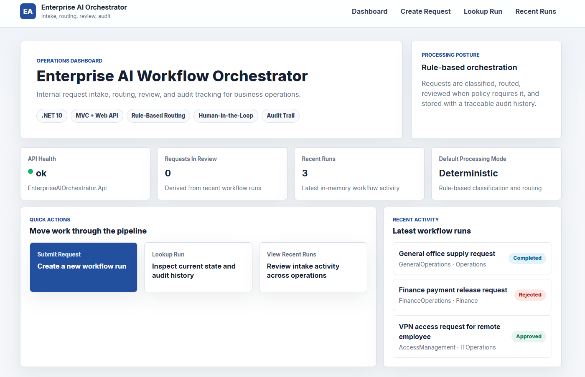
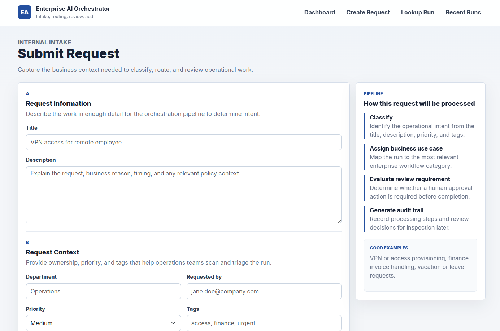
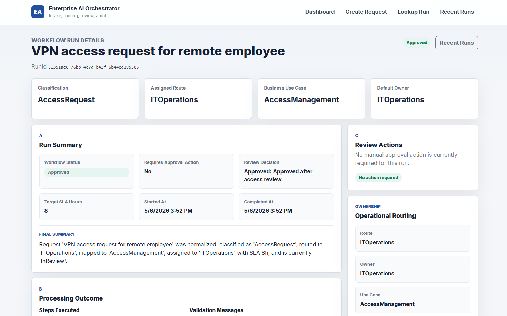
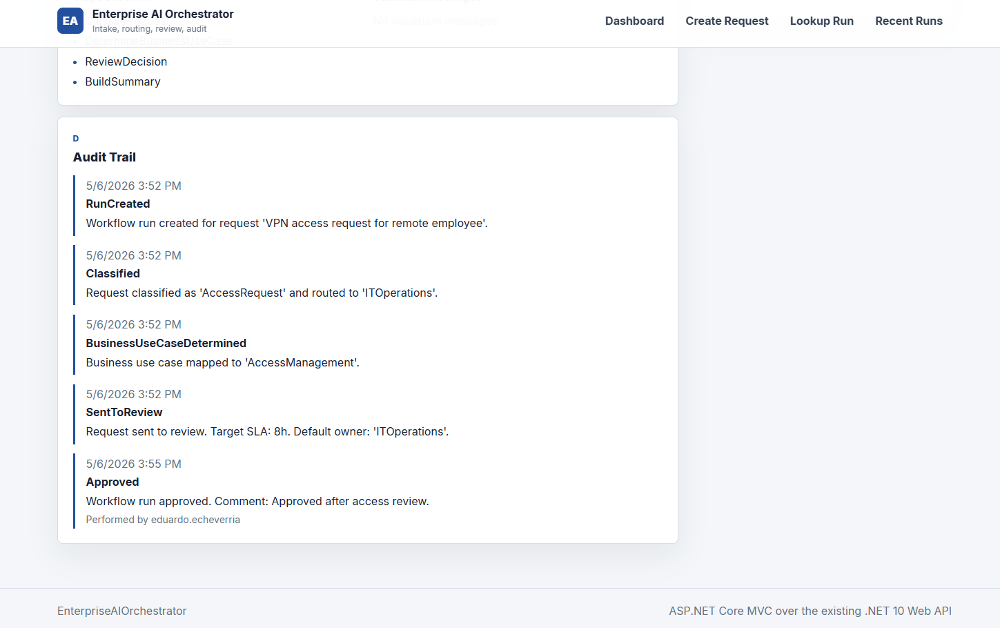
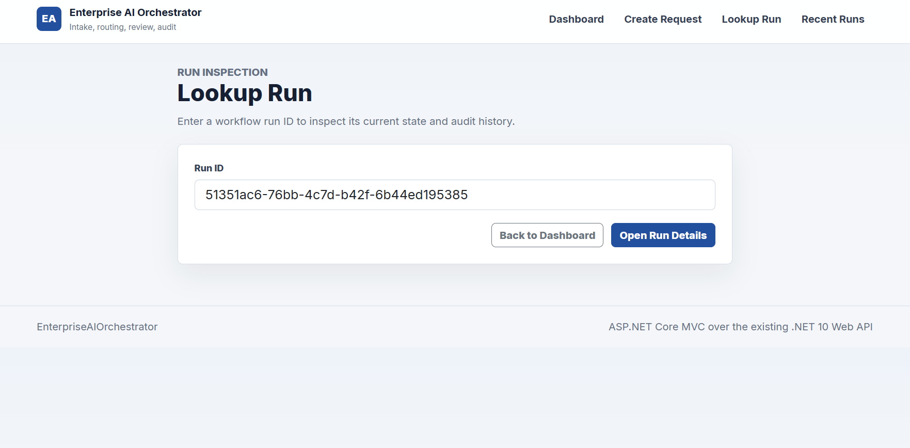
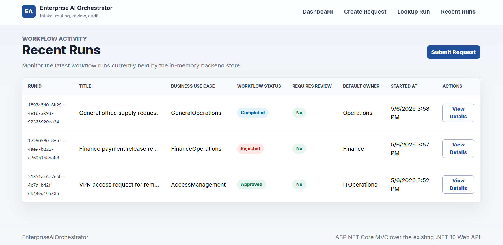

# EnterpriseAIOrchestrator

**A .NET 10 internal workflow orchestration platform for request intake, routing, human review, and audit tracking.**

EnterpriseAIOrchestrator is a pragmatic Clean Architecture solution that demonstrates how small and small-to-mid businesses can structure internal operational requests without jumping straight into heavyweight workflow products.

The system accepts internal work requests, classifies them with rule-based logic, maps them to a business use case, applies review policies, records an audit trail, and exposes the result through both a Web API and a professional ASP.NET Core MVC demo UI.

It is intentionally built as a real application foundation: backend-first, testable, layered, and ready for future persistence, authentication, deployment, and AI/agent integration without pretending those capabilities already exist.

## Demo Highlights

- Rule-based classification and routing
- Human-in-the-loop review flow
- Workflow status tracking
- Business use case mapping
- Audit trail for workflow events and review decisions
- Recent runs dashboard
- ASP.NET Core MVC demo UI over an ASP.NET Core Web API
- In-memory workflow run store
- .NET 10 solution with automated tests
## Screenshots

### Dashboard


### Submit Request


### Run Details


### Audit Trail


### Lookup Run


### Recent Runs


## Architecture

The solution follows a pragmatic Clean Architecture structure. The API and MVC web app are thin outer layers over application contracts, orchestration services, domain rules, and infrastructure adapters.

```text
src/
  EnterpriseAIOrchestrator.Api
  EnterpriseAIOrchestrator.Application
  EnterpriseAIOrchestrator.Domain
  EnterpriseAIOrchestrator.Infrastructure
  EnterpriseAIOrchestrator.Orchestration
  EnterpriseAIOrchestrator.Contracts
  EnterpriseAIOrchestrator.Web

tests/
  EnterpriseAIOrchestrator.Application.Tests
  EnterpriseAIOrchestrator.Domain.Tests
  EnterpriseAIOrchestrator.IntegrationTests
```

### Layer Responsibilities

| Project | Responsibility |
| --- | --- |
| `EnterpriseAIOrchestrator.Api` | ASP.NET Core Web API, health check, work request endpoints, approve/reject endpoints. |
| `EnterpriseAIOrchestrator.Web` | ASP.NET Core MVC demo UI for dashboard, request submission, lookup, details, review actions, and recent runs. |
| `EnterpriseAIOrchestrator.Application` | Use case contracts, pipeline abstractions, processing context, priority parsing, policies, audit models, and summary generation. |
| `EnterpriseAIOrchestrator.Domain` | Core `WorkRequest` aggregate, domain enums, and validation rules. |
| `EnterpriseAIOrchestrator.Orchestration` | Processing pipeline, rule-based classification, rule-based routing, business use case step, review decision step, and summary step. |
| `EnterpriseAIOrchestrator.Infrastructure` | In-memory workflow run store and infrastructure dependency injection. |
| `EnterpriseAIOrchestrator.Contracts` | API request/response DTOs, error DTOs, audit entry DTOs, and event contracts. |
| `EnterpriseAIOrchestrator.*.Tests` | Unit and integration-style tests covering domain behavior, application pipeline behavior, strategies, steps, and controller flows. |

## Workflow Overview

The current workflow is deterministic and rule-based:

1. A user submits an internal request through the MVC UI or API.
2. The system normalizes and validates the request.
3. The pipeline classifies the request.
4. The pipeline assigns a route.
5. The pipeline determines the business use case.
6. Review policies decide whether human approval is required.
7. The system generates a final summary and audit trail.
8. The workflow run is stored in memory.
9. Users can inspect the run by `RunId`.
10. If the run is in review, users can approve or reject it.
11. Users can view recent runs from the API or MVC dashboard.

## Business Value

Many small business operations start with informal intake: email threads, chat messages, spreadsheets, or untracked manual approvals. That creates practical problems:

- Inconsistent request intake
- Missing context for triage
- No clear priority model
- Manual review decisions without a reliable record
- Internal requests routed to the wrong owner
- No audit trail for operational decisions
- Difficulty explaining why a request was approved, rejected, or completed

EnterpriseAIOrchestrator demonstrates a structured alternative: a lightweight workflow engine that captures requests consistently, applies routing and review rules, and makes the processing history visible.

## Current Features

Implemented today:

- Create work requests
- Get workflow run by `RunId`
- Approve workflow runs when they are in review
- Reject workflow runs when they are in review
- Query recent workflow runs
- Workflow status tracking
- Request priority parsing
- Rule-based request classification
- Rule-based route assignment
- Business use case mapping
- Human-in-the-loop review policy
- Final workflow summary generation
- Audit trail entries for workflow processing and review decisions
- In-memory workflow run store
- ASP.NET Core MVC demo UI
- API health check
- Automated tests for domain, application, orchestration behavior, and controller flows
- Cloud deployment

Not implemented yet:

- Database persistence
- Authentication or authorization
- Microsoft Agent Framework integration
- External AI provider integration
  
## API Endpoints

| Method | Endpoint | Purpose |
| --- | --- | --- |
| `GET` | `/api/health` | Returns API health status. |
| `POST` | `/api/workrequests` | Creates and processes a new work request. |
| `GET` | `/api/workrequests/{runId}` | Retrieves a workflow run by ID. |
| `POST` | `/api/workrequests/{runId}/approve` | Approves an in-review workflow run. |
| `POST` | `/api/workrequests/{runId}/reject` | Rejects an in-review workflow run. |
| `GET` | `/api/workrequests/recent?count=20` | Returns recent workflow runs from the in-memory store. |

## Running Locally

### Prerequisites

- .NET 10 SDK
- PowerShell, Windows Terminal, or any terminal that can run `dotnet`

### Build

```powershell
dotnet build EnterpriseAIOrchestrator.sln
```

### Test

```powershell
dotnet test EnterpriseAIOrchestrator.sln -m:1 --verbosity minimal
```

The `-m:1` flag runs solution-level tests sequentially. This avoids intermittent VSTest solution parallelization issues seen in some local SDK environments.

### Run the API

```powershell
dotnet run --project src\EnterpriseAIOrchestrator.Api\EnterpriseAIOrchestrator.Api.csproj --launch-profile http
```

Default HTTP URL:

```text
http://localhost:5181
```

Swagger is available in Development mode through the API project.

### Run the MVC Web UI

In a second terminal:

```powershell
dotnet run --project src\EnterpriseAIOrchestrator.Web\EnterpriseAIOrchestrator.Web.csproj --launch-profile http
```

Default HTTP URL:

```text
http://localhost:5084
```

The MVC project calls the API using the configured `ApiBaseUrl`.

## Example Scenarios

### Access Request

Example:

```text
Title: VPN Access
Description: Need VPN access for a remote employee.
Department: Operations
Requested By: jane.doe@company.com
Priority: medium
Tags: access, remote
```

Expected behavior: the system can classify the request as an access-related request, route it to IT operations, and apply review policy if required.

### Finance Request

Example:

```text
Title: Payment Release Approval
Description: Requesting approval to release an invoice payment for a vendor.
Department: Finance
Requested By: finance.lead@company.com
Priority: high
Tags: finance, invoice, payment
```

Expected behavior: the system can map the request to a finance-related business use case and send it through review when policy requires human approval.

### General Operations Request

Example:

```text
Title: Office Supplies
Description: Need replacement supplies for the branch office.
Department: Administration
Requested By: ops.coordinator@company.com
Priority: low
Tags: office, supplies
```

Expected behavior: the system can process lower-risk operational requests without manual review when policy allows completion.

## Planned Improvements

These are planned next steps, not current features:

- Database persistence for workflow runs
- Authentication and authorization
- Azure deployment, such as Azure App Service
- Local-first AI or Microsoft Agent Framework integration
- Richer observability and structured operational logs
- More advanced business policy configuration
- Stronger UI filtering and search for recent runs
- Production-ready environment configuration

## Why This Project Matters

EnterpriseAIOrchestrator is designed as a portfolio-quality example of practical backend and product engineering.

It demonstrates:

- Clean Architecture applied pragmatically in .NET
- API-first workflow design
- Domain modeling around internal business requests
- Rule-based orchestration without overengineering
- Human approval flows with auditable decisions
- Separation between contracts, application logic, orchestration, infrastructure, and UI
- MVC as a professional internal dashboard rather than a marketing page
- Test coverage across domain, application, strategy, pipeline, and controller behavior
- Product thinking around small business operational workflows

The project is intentionally scoped: it solves the current workflow problem clearly while leaving a clean path for persistence, security, deployment, and future AI/agent capabilities.
